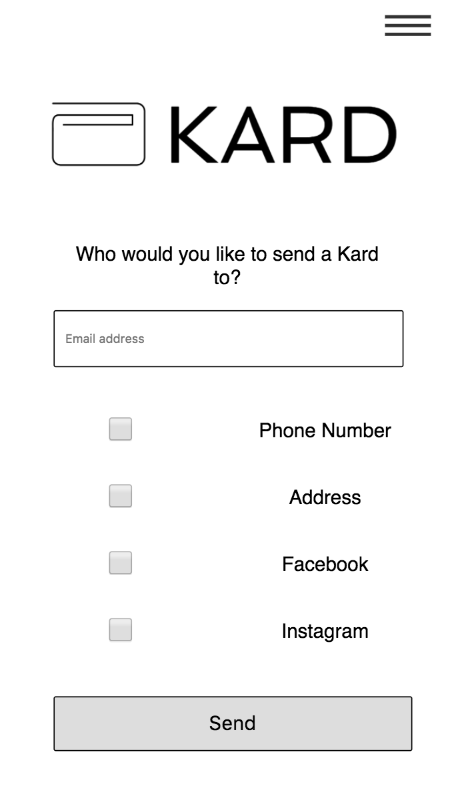
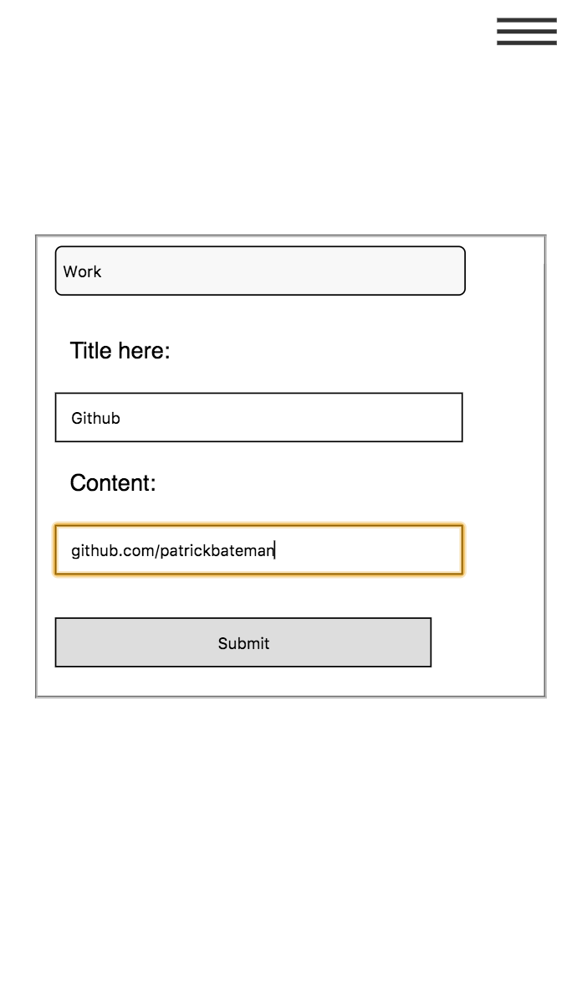
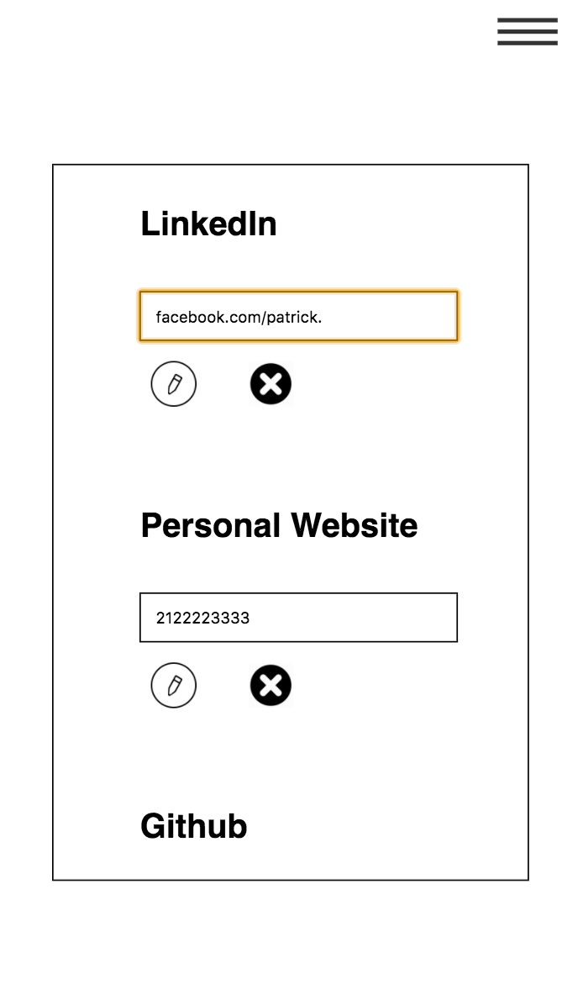

# Kard App


## the Application

Kard App is a handy way to send digital business cards, contact information, or social media profiles right from the web or your phone.

Imagine that you're at a social event, networking event, or even just at the bar or coffee shop. You meet someone and you want to exchange contact info or connect on social media. Instead of going through the hassle of filling out contact info on someone's phone or looking up social media handles, simply open up Kard App, enter the email of the person you want to send info to, and then select what info you want to send.

Our current MVP is designed as a web app meant to be used on mobile, however, we have plans to port it to a true native app with React Native.

## Screengrabs

From the home screen you can enter someone's email and choose what info to send them:



You can add new profiles and information from the add item screen:



And from the edit screen you can update or remove info:



## the Backend

Our backend is a simple, RESTful style API. All endpoints are prefixed by `/api/kard`.

Sending a GET request to `/api/kard` currently returns all Kards (which are essentially single user's complete profile). As the MVP is only set up with a single user's test data, the front end accounts for this and operates with whatever the first item in the database is.

We have POST endpoint at `/api/kard` as well that allows for additional Kards (users) to be created. However, this functionality will be added in eventually to allow users to sign up and log in.

A PUT request to `api/kard/insert/:id` takes an object in the format of: ```[category]:
  {
    type: 'Name of Media',
    content: 'Content (URL, handle, etc)'
  }```
  where `[category]` is user selectable as `Social`, `Work`, or `Contact`.

A PUT request to `api/kard/update/:id` takes an object of the same form as the above but the value of each `[category]` is an array that corresponds to the array held in the database. It is used to delete and item, by passing the db array minus the deleted object, and to edit items, by passing the same array with the updated item.

A DELETE endpoint also exists at `/api/kard/:id` for future use to delete a Kard (user account).

The final endpoint is a POST endpoint to `/api/kard/email`. This endpoint expects a request body in JSON that corresponds to the database category content. This is used by the front end when the user enters an email (which is also passed in the request body) and selects his or her information. This endpoint uses mailgun-js to access the Mailgun api and sends an email.

## the Front End

The front end is currently a straight up React application that proxies to the back end, allowing it to be deployed as a singe application with access to the back end api.

## the Stack

* **The Back End**
  * Standard Mongo, Express, Node setup with the Mongo instance deployed on mLab and Mongoose used for modeling.
  * [Mailgun](https://www.mailgun.com/) was used as our email API with [mailgun-js](https://www.npmjs.com/package/mailgun-js) used to run it from node.
  * Everything build in Node and deployed to Heroku.

* **The Front End**
  * All React/Redux on the front end with CSS designed in flexbox (to make porting to React Native easier).

* **Next Steps**
  * Consider adding Twilio API to send SMS messages as well as email.
  * Port the project to React Native.
  * Revamp CSS and overall design.
  * Expand database to hold more complex information.
  * Add authentication and login.
  * Format HTML email that is sent to users. 
